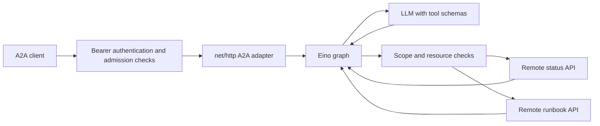

# goaiagent — Eino + A2A operations assistant

The Go counterpart to [pyaiagent](../pyaiagent/README.md) and
[javaaiagent](../javaaiagent/README.md). It answers **“Why is payments degraded,
and what should I check?”** through an explicit model → tools → model graph,
using remote status and runbook HTTP APIs.

**Eino** provides Go-native graph orchestration and the OpenAI model adapter.
It is a separate framework, not a Go distribution of LangGraph. The official
A2A Go SDK supplies the Agent Card, message, part and request types. A small
`net/http` adapter implements the same **A2A 0.3 single-turn JSON-RPC profile**
as the other projects; it does not implement the full A2A task lifecycle.

## Build and run

Requires **Go 1.26.5+** (the version pinned in `go.mod`). From `goaiagent`:

```powershell
go mod download
go test ./...
go build -o bin/ ./cmd/goaiagent
```

Start each command in a separate terminal, from `goaiagent`:

```powershell
./bin/goaiagent mock status
```

```powershell
./bin/goaiagent mock runbook
```

```powershell
./bin/goaiagent
```

Then call the agent in another terminal:

```powershell
./bin/goaiagent client "Why is payments degraded, and what should I check?"
```

The same commands work in bash. On Windows, the built binary is
`bin/goaiagent.exe`; PowerShell resolves the extension automatically.
For development, `go run ./cmd/goaiagent` runs the agent without a separate build.

The agent listens on `127.0.0.1:8090`; the mock APIs listen on `8091` and `8092`.
These ports let Go, Python and Java run side by side. The mocks are **independent
HTTP servers**, not in-process functions pretending to be remote tools.

Defaults require no provider key or `.env` file. Output explicitly says
`DEMO (scripted, no LLM)` and includes `demo-status:payments` and
`demo-runbook:payments` sources. This deterministic substitute exercises the
actual graph, A2A endpoints, auth and remote APIs; it is not generative AI.

## Use a real LLM

Set these variables in the agent terminal and restart it:

```powershell
$env:MODEL_MODE="openai"
$env:OPENAI_API_KEY="your-provider-key"
$env:LLM_MODEL="gpt-4.1-mini"
./bin/goaiagent
```

In bash use `export NAME=value` instead. Choose a tool-calling model available
to your account. User text and permitted tool results are sent to that provider.
The model adapter binds tool schemas; **the Eino graph executes tool calls**.
The graph explicitly limits the number of rounds and calls instead of handing
control to an unbounded built-in agent loop.



## Project map

| File | Responsibility |
| --- | --- |
| `cmd/goaiagent/main.go` | Server, mock-service and client commands; graceful shutdown |
| `internal/agent/server.go` | Discovery, A2A wire types, validation, deadlines and admission |
| `internal/agent/graph.go` | Explicit Eino model → tools → model graph and request-local state |
| `internal/agent/model.go` | Demo model and real Eino OpenAI adapter |
| `internal/agent/tools.go` | Two typed remote tools, authorization, response schemas |
| `internal/agent/auth.go` | Verified RS256 JWT identity and scopes |
| `internal/agent/config.go` | Environment configuration and production checks |
| `internal/agent/http.go` | Nonredirecting HTTP, size bounds and JSON helpers |
| `internal/agent/mock.go` | Synthetic remote API fixtures |
| `internal/agent/client.go` | Protected discovery and a single-turn A2A request |
| `internal/agent/agent_test.go` | HTTP, graph, model-adapter and security boundary tests |

Direct dependency versions and transitive selections are recorded in `go.mod`;
`go.sum` records checksums. The A2A SDK is pinned to `v0.3.15` for protocol 0.3
compatibility. Eino is `v0.9.21`; its OpenAI adapter is `v0.1.13`. This example
does not claim compatibility with the A2A 1.0 wire format.

## Interface and configuration

- `GET /.well-known/agent-card.json`: bearer-protected discovery.
- `POST /`: JSON-RPC `message/send`, returning an A2A Message.
- `GET /healthz`: public liveness with no secrets or downstream records.

Streaming, task retrieval, push callbacks and conversation reuse are unsupported.
Each call gets fresh graph state; the agent does not persist messages or create
background tasks. Tools are ordinary HTTP GET APIs, not additional A2A agents.

Environment variables (Go does **not** automatically read `.env`):

| Variable | Default / purpose |
| --- | --- |
| `ENVIRONMENT` | `local`; `production` enables startup safeguards |
| `MODEL_MODE` | `demo` or `openai` |
| `OPENAI_API_KEY`, `LLM_MODEL` | Provider key; default model `gpt-4.1-mini` |
| `SERVER_ADDRESS`, `SERVER_PORT` | `127.0.0.1`, `8090` |
| `AGENT_URL` | `http://127.0.0.1:8090/`; advertised URL and client target |
| `STATUS_URL`, `RUNBOOK_URL` | Tool base URLs; loopback ports 8091 and 8092 |
| `STATUS_TOKEN`, `RUNBOOK_TOKEN` | Independent downstream credentials |
| `AUTH_MODE` | `demo` or `jwt` |
| `DEMO_TOKEN` | Public local token `local-demo-client-token` |
| `JWT_PUBLIC_KEY_FILE` | Trusted RSA public key PEM, at least 2048 bits |
| `JWT_ISSUER`, `JWT_AUDIENCE` | `https://identity.example.com/`, `jagent` |
| `A2A_TOKEN` | Client access token acquired separately from the identity provider |

JWT mode checks RS256 signatures, issuer, audience, expiry, issued-at and subject.
It requires `iss`, `aud`, `exp`, `iat`, and `sub`. Authorization claims match the
other agents:

```json
{"scope":"agent:invoke status:read runbooks:read","services":["payments","orders"]}
```

The issuer must derive those grants from trusted policy. Invalid credentials
return 401; missing `agent:invoke` returns 403. A missing tool or resource grant
produces a safe denial **before** an HTTP request. Caller tokens are never sent
to tools. See [security.md](docs/security.md) for the complete deployment boundary.

## Verification

```powershell
go mod verify
go vet ./...
go test ./... -count=1
```

Tests use real loopback HTTP servers for A2A, tools and a simulated LLM endpoint.
The LLM test exercises the actual Eino provider adapter's tool definitions,
tool-call parsing and follow-up tool results without spending provider credits.
CI also runs `go test -race ./...` on Linux. Locally, race detection requires a
supported C compiler in addition to Go.

For all three implementations, build the Java JAR and Go binary, then from the
repository root run:

```powershell
uv run --project pyaiagent python scripts/verify_interop.py --with-go
```

This starts three agents and two Go mock APIs on temporary loopback ports, tests
all six cross-language client/agent pairings, then stops its own processes.

## Container

```powershell
docker build -t goaiagent .
```

The image runs a static binary as a non-root user and listens on port 8090.
Supply approved downstream URLs, credentials and issuer key mounts at deployment
time. TLS termination, global rate limits and egress policy belong at ingress
and the platform layer. Docker and paid-provider calls are not required by the
no-key test suite.

References: [Eino graph orchestration](https://github.com/cloudwego/eino),
[Eino OpenAI adapter](https://github.com/cloudwego/eino-ext/tree/main/components/model/openai),
[A2A Go SDK 0.3](https://github.com/a2aproject/a2a-go/tree/v0.3.15).
