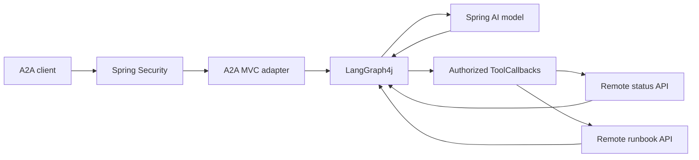

# javaaiagent — Spring AI + LangGraph4j + A2A

The Java counterpart to [pyaiagent](../pyaiagent/README.md): a read-only operations
assistant that answers **“Why is payments degraded, and what should I check?”**
using two remote HTTP APIs. It exposes A2A 0.3 discovery and JSON-RPC, invokes an
LLM through Spring AI, and uses LangGraph4j to orchestrate the tool loop.

The default mode is a **deterministic model substitute**, labelled `DEMO (scripted,
no LLM)`. It still exercises the actual Spring server, A2A wire types, graph,
authentication and remote HTTP services. Real generative behavior requires
`MODEL_MODE=openai` and your provider key.

## Build and run

Requires **Java 21+ and Maven 3.9+**. From `javaaiagent`:

```powershell
mvn verify
```

Start each command in a separate terminal, from `javaaiagent`:

```powershell
java -jar target/javaaiagent-0.1.0.jar mock status
```

```powershell
java -jar target/javaaiagent-0.1.0.jar mock runbook
```

```powershell
java -jar target/javaaiagent-0.1.0.jar
```

Then invoke the client in another terminal:

```powershell
java -jar target/javaaiagent-0.1.0.jar client "Why is payments degraded, and what should I check?"
```

These commands also work in bash. The agent binds to `127.0.0.1:8080`; the APIs
use `8081` and `8082`. All use the same public **local-only** demo credentials as
the Python project. No `.env` file is needed or automatically loaded by Java.
The output includes degraded payments health, suggested investigation steps, and
`demo-status:payments` / `demo-runbook:payments` source identifiers.

For an edit/run loop, `mvn spring-boot:run` runs just the agent. The packaged JAR
also supports the `mock` and `client` commands without starting Spring Boot.

## Use a real model

Set these in the agent's terminal, then restart the agent:

```powershell
$env:MODEL_MODE="openai"
$env:OPENAI_API_KEY="your-provider-key"
$env:LLM_MODEL="gpt-4.1-mini"
java -jar target/javaaiagent-0.1.0.jar
```

In bash, use `export MODEL_MODE=openai`, `export OPENAI_API_KEY=...`, and
`export LLM_MODEL=gpt-4.1-mini`. Choose a tool-calling model available to your
account. Prompts and permitted tool results are sent to that provider.

Spring AI receives the tools as `ToolCallback` schemas, with
`internalToolExecutionEnabled(false)`. **LangGraph4j owns tool execution and the
loop bounds**, so hidden automatic tool execution cannot bypass the graph's
policy boundary. The model's tool names and arguments are checked again in code.



## Project map

All Java classes are under `src/main/java/com/example/javaaiagent`.

| Class | Responsibility |
| --- | --- |
| `AgentApplication` | Spring Boot entry point and mock/client command dispatch |
| `A2aController` | Agent Card, bounded JSON-RPC input, SDK request/response types |
| `OperationsGraph` | Explicit model → tools → model loop, fresh request state |
| `ModelConfiguration` | Spring AI model adapter and deterministic demo substitute |
| `Turn` / `AgentModel` | Serializable conversation state and model boundary |
| `RemoteTools` | Two narrow read-only tools with scope and resource checks |
| `BoundedHttp` | Nonredirecting HTTP, body-size bounds and total response timeout |
| `SecurityConfiguration` / `Caller` | RS256 verification, verified caller grants |
| `AdmissionFilter` | Concurrency limit, request identifiers and audit events |
| `AgentSettings` | Typed configuration and production startup checks |
| `MockServices` | Independent synthetic status/runbook servers |
| `AgentClient` | Authenticated discovery and an A2A request |

## Protocol and version choices

Dependencies are pinned in `pom.xml`: Spring Boot **3.5.16**, Spring AI **1.1.8**,
LangGraph4j **1.8.27**, and official Java A2A SDK spec **0.3.3.Final**.
This deliberately uses the compatible Spring Boot 3 / Spring AI 1 release lines
and A2A **0.3**, matching the Python project. It is not an A2A 1.0 implementation.

The Java SDK's `AgentCard`, `SendMessageRequest`, `Message`, and
`SendMessageResponse` types define the wire format. A small Spring MVC adapter
implements the single-turn transport. It does not pull the SDK's Quarkus/CDI
reference server into Spring or claim to implement the entire A2A task lifecycle.

Supported endpoints:

- `GET /.well-known/agent-card.json`: protected discovery.
- `POST /`: JSON-RPC `message/send`, returning an A2A Message.
- `GET /healthz`: public liveness, with no downstream data.

Streaming, task retrieval, push callbacks, background tasks and conversation
reuse are unsupported. No history or task store is shared across requests.
Nontext input and client-supplied task/context references are rejected. Optional
null fields emitted by the Python SDK are accepted for new messages.

## Configuration

Set environment variables or pass equivalent `--agent.*` Spring properties.

| Environment variable | Default / use |
| --- | --- |
| `ENVIRONMENT` | `local`; production rejects demo modes and insecure tool settings |
| `MODEL_MODE` | `demo` or `openai` |
| `OPENAI_API_KEY`, `LLM_MODEL` | Provider key and model name |
| `SERVER_ADDRESS`, `SERVER_PORT` | `127.0.0.1`, `8080` |
| `AGENT_URL` | Advertised URL; also used by the standalone client |
| `STATUS_URL`, `RUNBOOK_URL` | Fixed downstream base URLs, default ports 8081 / 8082 |
| `STATUS_TOKEN`, `RUNBOOK_TOKEN` | Independent downstream service credentials |
| `AUTH_MODE` | `demo` or `jwt` |
| `DEMO_TOKEN` | Public `local-demo-client-token`; local only |
| `JWT_PUBLIC_KEY_FILE` | Trusted RSA public key in X.509 PEM format |
| `JWT_ISSUER`, `JWT_AUDIENCE` | Expected issuer and audience |
| `A2A_TOKEN` | Client-only access token acquired from your identity provider |

JWTs require `iss`, `aud`, `sub`, `iat` and `exp`. Authorization uses the same
trusted claims as Python:

```json
{"scope":"agent:invoke status:read runbooks:read","services":["payments","orders"]}
```

The issuer must derive these grants from policy. Invalid credentials return 401;
missing `agent:invoke` returns 403. Tool or resource denials return safe results
without contacting the remote API. Caller bearer tokens are never forwarded.

See [security.md](docs/security.md) and the deployment configuration template
[production.example.properties](config/production.example.properties).

## Verification and deployment

`mvn verify` tests the real Spring HTTP server, A2A parsing, signed JWT validation,
remote tool boundaries and graph limits. A simulated provider endpoint exercises
the **real Spring AI OpenAI adapter**, including tool schemas, tool-call parsing
and follow-up tool results, without a paid LLM call.

For interoperability with Python, run the [root smoke test](../README.md#cross-language-check).
Both implementations can consume either set of mock APIs by changing their tool
URLs; default ports differ so the agents can run side by side.

```powershell
docker build -t javaaiagent .
```

The image runs as UID 10001 and listens on port 8080. Supply approved HTTPS tool
URLs and deployment secrets at runtime; mock services are not bundled into the
agent process. Docker build and paid-provider calls require external facilities
and are not part of the no-key verification suite.

References: [Spring AI tool execution](https://docs.spring.io/spring-ai/reference/api/tools.html),
[LangGraph4j](https://github.com/langgraph4j/langgraph4j),
[A2A Java SDK 0.3](https://github.com/a2aproject/a2a-java/tree/v0.3.3.Final), and
[A2A enterprise guidance](https://a2a-protocol.org/v0.3.0/topics/enterprise-ready/).
