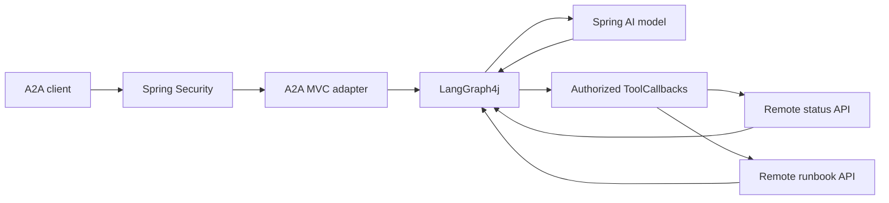

# javaaiagent — Spring AI + LangGraph4j + A2A

The Java counterpart to [pyaiagent](../pyaiagent/README.md): a read-only operations
assistant that answers **“Why is payments degraded, and what should I check?”**
using two remote HTTP APIs. It exposes A2A 0.3 discovery and JSON-RPC, invokes an
LLM through Spring AI, and uses LangGraph4j to orchestrate the tool loop.

The default is **local development with a real local LLM**: `ENVIRONMENT=local`,
`MODEL_MODE=openai`, model alias `qwen3.5-9b`, and the OpenAI-compatible endpoint
`http://localhost:6666/v1/chat/completions`. Here `openai` selects the API adapter;
it does not mean requests go to the OpenAI cloud. Scripted no-LLM mode is opt-in.

## Build and run

Requires **Java 21+ and Maven 3.9+**. From `javaaiagent`:

```powershell
mvn verify
```

First start your local model server on port 6666 with tool calling enabled and
alias `qwen3.5-9b` (for example, your Qwen3.5-9B-Q4_K_M llama-server with `--jinja`).
The alias must match the server's `/v1/models` response, not the GGUF filename.
The bundled local-development key must match the server; set `OPENAI_API_KEY`
if it uses a different key. For a different server or alias, set `OPENAI_BASE_URL`
and `LLM_MODEL` before starting the agent.

Start each command in a separate terminal, from `javaaiagent`:

```powershell
java -jar target/javaaiagent-0.1.0.jar mock status
```

```powershell
java -jar target/javaaiagent-0.1.0.jar mock runbook
```

```powershell
java -jar target/javaaiagent-0.1.0.jar
```

Then invoke the client in another terminal:

```powershell
java -jar target/javaaiagent-0.1.0.jar client "Why is payments degraded, and what should I check?"
```

These commands also work in bash. The agent binds to `127.0.0.1:8080`; the APIs
use `8081` and `8082`. All use the same public **local-only** demo credentials as
the Python project. No `.env` file is needed or automatically loaded by Java.
The model uses synthetic status/runbook data from those APIs, including
`demo-status:payments` / `demo-runbook:payments` source identifiers. Model-generated
proposals must pass evidence validation; malformed or unsupported proposals return
a safe rejection. A missing model server causes a request failure, not a silent
fallback to the scripted demo.

For an edit/run loop, `mvn spring-boot:run` runs just the agent. The packaged JAR
also supports the `mock` and `client` commands without starting Spring Boot.

## Customize prompts and messages

For an opt-in real-model quality baseline, see [evaluations](docs/evaluations.md).
The versioned 11-scenario suite measures tool selection, grounded output,
authorization, latency and token usage. Ordinary tests remain offline; live runs
require explicit provider configuration and produce JSON reports.

Final answers are checked against evidence from the current request. The model
returns a JSON proposal identifying observed service health and runbook sources;
the application rejects invented, missing or mismatched evidence and renders the
answer from validated tool data. Free-form model claims are not returned. Source
summaries and runbook steps are quoted as untrusted, source-provided content for
human review. See [evidence validation](docs/evidence.md) for the contract and limits.

Application-owned prompts, tool schemas and message payloads are stored in
[templates/messages.json](src/main/resources/templates/messages.json). Select a
partial override file with `agent.templates.location` in YAML or
`MESSAGE_TEMPLATES_LOCATION`. See [templates.md](docs/templates.md) for safe
placeholders, editable entries and examples. Restart to load changes.

## Scripted demo without an LLM

Keep the mock APIs running and explicitly select demo mode for the agent:

```powershell
java -jar target/javaaiagent-0.1.0.jar --agent.model-mode=demo
```

Alternatively set `MODEL_MODE=demo`. Replies are labelled `DEMO (scripted, no LLM)`.
The actual Spring server, A2A transport, graph, authentication, and remote tool
calls still run. `AUTH_MODE=demo` controls local client authentication separately
and does not select the scripted model.

## Use another model provider

Set these in the agent's terminal, then restart the agent:

```powershell
$env:MODEL_MODE="openai"
$env:OPENAI_BASE_URL="https://api.openai.com"
$env:OPENAI_API_KEY="your-provider-key"
$env:LLM_MODEL="gpt-4.1-mini"
java -jar target/javaaiagent-0.1.0.jar
```

In bash, set the same variables with `export`. Always select the provider URL,
key and model together. Choose a tool-calling model available to your
account. Prompts and permitted tool results are sent to that provider.

Spring AI receives the tools as `ToolCallback` schemas, with
`internalToolExecutionEnabled(false)`. **LangGraph4j owns tool execution and the
loop bounds**, so hidden automatic tool execution cannot bypass the graph's
policy boundary. The model's tool names and arguments are checked again in code.



## Reading the example

Follow the [code walkthrough](docs/code-walkthrough.md) for a guided request trace,
security decisions, model/tool interaction and timeout ownership. Source comments
explain why the boundaries exist; short helpers name the individual steps.

## Project map

The application uses package modules under `src/main/java/com/example/javaaiagent`:

| Package | Responsibility |
| --- | --- |
| `api` | A2A HTTP transport and message parsing |
| `application` | Graph, model contract, immutable state and bounded execution |
| `bootstrap` | Model wiring and resource lifecycle |
| `config` | Validated settings and command inputs |
| `model` | Demo and Spring AI model adapters |
| `tools` | Authorized remote tool callbacks |
| `concurrent` | Shared bounded worker execution and cancellation |
| `http` | Bounded HTTP and strict JSON |
| `templates` | Validated prompt/message catalogs and safe JSON rendering |
| `security` | Identity, JWT and admission control |
| `cli` | Standalone A2A client |
| `demo` | Synthetic downstream API commands |

`AgentApplication` remains the root entry point. Tests mirror the source packages;
`config/` contains deployment examples and `docs/` contains architecture and security guidance.

See [architecture.md](docs/architecture.md) for dependency boundaries, ownership
and extension guidance. This remains one executable JAR; ArchUnit checks keep
package dependencies acyclic and prevent server code from depending on demo commands.

Format source and tests with `mvn spotless:apply`. Run `mvn verify spotless:check`
for architecture checks, tests, packaging and an explicit formatting check.
See [refactoring-review.md](docs/refactoring-review.md) for the design review.

## Protocol and version choices

Dependencies are pinned in `pom.xml`: Spring Boot **3.5.16**, Spring AI **1.1.8**,
LangGraph4j **1.8.27**, and official Java A2A SDK spec **0.3.3.Final**.
This deliberately uses the compatible Spring Boot 3 / Spring AI 1 release lines
and A2A **0.3**, matching the Python project. It is not an A2A 1.0 implementation.

The Java SDK's `AgentCard`, `SendMessageRequest`, `Message`, and
`SendMessageResponse` types define the wire format. A small Spring MVC adapter
implements the single-turn transport. It does not pull the SDK's Quarkus/CDI
reference server into Spring or claim to implement the entire A2A task lifecycle.

Supported endpoints:

- `GET /.well-known/agent-card.json`: protected discovery.
- `POST /`: JSON-RPC `message/send`, returning an A2A Message.
- `GET /healthz`: public liveness, with no downstream data.

Streaming, task retrieval, push callbacks, background tasks and conversation
reuse are unsupported. No history or task store is shared across requests.
Nontext input and client-supplied task/context references are rejected. Optional
null fields emitted by the Python SDK are accepted for new messages.

## Configuration

Configuration is YAML: [application.yaml](src/main/resources/application.yaml).
Set environment variables, load an external YAML file, or pass equivalent
`--agent.*` Spring properties. See [configuration.md](docs/configuration.md) for
all network/LLM timeouts, defaults, validation and deployment examples.

| Environment variable | Default / use |
| --- | --- |
| `ENVIRONMENT` | `local`; production rejects demo modes and insecure tool settings |
| `MODEL_MODE` | `openai` by default (real local LLM); `demo` explicitly selects the scripted model |
| `LLM_MODEL` | `qwen3.5-9b`; must match the provider's advertised alias |
| `OPENAI_API_KEY` | Bundled local-development key; override to match your provider |
| `OPENAI_BASE_URL` | `http://localhost:6666`; provider root, without `/v1` |
| `OPENAI_COMPLETIONS_PATH` | Chat request path; defaults to `/v1/chat/completions` |
| `SERVER_ADDRESS`, `SERVER_PORT` | `127.0.0.1`, `8080` |
| `AGENT_URL` | Advertised URL; also used by the standalone client |
| `STATUS_URL`, `RUNBOOK_URL` | Fixed downstream base URLs, default ports 8081 / 8082 |
| `STATUS_TOKEN`, `RUNBOOK_TOKEN` | Independent downstream service credentials |
| `AUTH_MODE` | `demo` by default for local client authentication; `jwt` for production |
| `DEMO_TOKEN` | Public `local-demo-client-token`; local only |
| `JWT_PUBLIC_KEY_FILE` | Trusted RSA public key in X.509 PEM format |
| `JWT_ISSUER`, `JWT_AUDIENCE` | Expected issuer and audience |
| `A2A_TOKEN` | Client-only access token acquired from your identity provider |
| `AGENT_LOG_LEVEL`, `AI_LOG_LEVEL`, `GRAPH_LOG_LEVEL` | `INFO`; opt into `DEBUG` for local troubleshooting |

Startup rejects missing mode-specific settings, blank or header-unsafe tokens,
and service URLs with credentials, queries, fragments or invalid ports. Validation
errors identify configuration fields without printing their secret values.

JWTs require `iss`, `aud`, `sub`, `iat` and `exp`. Authorization uses the same
trusted claims as Python:

```json
{"scope":"agent:invoke status:read runbooks:read","services":["payments","orders"]}
```

The issuer must derive these grants from policy. Invalid credentials return 401;
missing `agent:invoke` returns 403. Tool or resource denials return safe results
without contacting the remote API. Caller bearer tokens are never forwarded.

See [security.md](docs/security.md) and the deployment configuration template
[production.example.yaml](config/production.example.yaml).

## Verification and deployment

`mvn verify` tests the real Spring HTTP server, A2A parsing, signed JWT validation,
remote tool boundaries and graph limits. A simulated provider endpoint exercises
the **real Spring AI OpenAI adapter**, including tool schemas, tool-call parsing
and follow-up tool results, without a paid LLM call.

For interoperability with Python, run the [root smoke test](../README.md#cross-language-check).
Both implementations can consume either set of mock APIs by changing their tool
URLs; default ports differ so the agents can run side by side.

```powershell
docker build -t javaaiagent .
```

The image runs as UID 10001 and listens on port 8080. Supply approved HTTPS tool
URLs and deployment secrets at runtime; mock services are not bundled into the
agent process. Docker build and paid-provider calls require external facilities
and are not part of the no-key verification suite.

References: [Spring AI tool execution](https://docs.spring.io/spring-ai/reference/api/tools.html),
[LangGraph4j](https://github.com/langgraph4j/langgraph4j),
[A2A Java SDK 0.3](https://github.com/a2aproject/a2a-java/tree/v0.3.3.Final), and
[A2A enterprise guidance](https://a2a-protocol.org/v0.3.0/topics/enterprise-ready/).

## Agent diagnostics

See [observability.md](docs/observability.md) for request-correlated model/tool
latency, token accounting, optional cost estimates, termination reasons and safe
logging. Failed executions and evidence rejections now return JSON-RPC errors
with stable reason codes; clients must check the envelope even when HTTP is 200.
