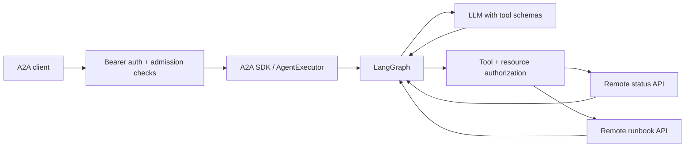

# jagent — a small enterprise-minded agent example

This Python project now lives in `pyaiagent/`; run all commands below from that
directory. Its Python package remains `jagent`. The equivalent Java implementation
is in [javaaiagent](../javaaiagent/README.md), with a shared comparison and
interoperability check in the [repository README](../README.md).

A runnable Python agent that answers operations questions using an LLM, a
LangGraph tool loop, and two remote HTTP data services. Clients discover and call
the agent using **A2A 0.3 JSON-RPC**, implemented by the official Python A2A SDK.
The SDK is intentionally constrained to its 0.3 release line; this is not an
implementation of A2A 1.0. Exact dependency versions are recorded in `uv.lock`.

The example question is: **“Why is payments degraded, and what should I check?”**
The agent can read service health and a runbook. It cannot change infrastructure.
Included APIs serve clearly labelled synthetic fixtures in separate processes.



A2A is the **agent-facing protocol**. The tools use ordinary HTTP APIs;
A2A does not require remote tools to also be agents or to use MCP.

## Run locally

Requires Python 3.11+ and [uv](https://docs.astral.sh/uv/). From this directory:

```powershell
uv sync --locked
Copy-Item .env.example .env
```

Start each command in its own terminal, in this directory:

```powershell
uv run python -m jagent.mock_services status
```

```powershell
uv run python -m jagent.mock_services runbook
```

```powershell
uv run python -m jagent.server
```

Then call the agent from another terminal:

```powershell
uv run python -m jagent.client "Why is payments degraded, and what should I check?"
```

On macOS/Linux, use `cp .env.example .env`; the Python commands are the same.
All three servers bind to loopback. No Docker or cloud account is required.
The client first fetches the protected `/.well-known/agent-card.json`, then sends
`message/send` to `/` and prints the SDK-validated A2A response.
Expected output includes a `DEMO (scripted, no LLM)` answer, degraded payments
health, runbook steps, and `demo-status:payments` / `demo-runbook:payments` sources.

**Default demo mode is a deterministic model substitute**, not generative AI.
It exercises the real A2A server, LangGraph loop, authorization, and both HTTP
services without requiring a provider key. To invoke a real LLM, edit `.env`:

```dotenv
MODEL_MODE=openai
OPENAI_API_KEY=your-provider-key
LLM_MODEL=gpt-4.1-mini
```

Restart the agent. `ChatOpenAI.bind_tools()` now lets the model decide which tools
to call and generate the final answer. Choose a tool-calling model available to
your account. Prompts and permitted tool results are sent to that provider;
the example does not enable tracing or record prompts in its audit logs.

## Where to look

| File | Responsibility |
| --- | --- |
| `jagent/server.py` | Agent Card, A2A adapter, request deadline, safe errors |
| `jagent/graph.py` | Model → tools → model loop and execution limits |
| `jagent/tools.py` | Typed remote tools, permission checks, bounded responses |
| `jagent/security.py` | Verified identity, scopes, request limits, audit events |
| `jagent/config.py` | Environment configuration and production startup checks |
| `jagent/mock_services.py` | Two independently hosted synthetic data APIs |
| `jagent/client.py` | Discovery and a minimal A2A request |
| `tests/test_agent.py` | Protocol, graph, authentication, and tool boundary tests |
| `docs/security.md` | Trust boundaries and enterprise deployment requirements |

This is deliberately single-turn: `message/send` returns an A2A **Message**,
not a durable Task. Streaming, push notifications, conversation reuse and
background jobs are not advertised. There is no cross-request memory; the SDK's
in-memory task store is present to satisfy its handler interface, but this
executor does not create Tasks. Add ownership checks and persistence before
extending it with task retrieval, resumable work, or multi-turn history.

## JWT authentication

For an enterprise identity integration, configure `AUTH_MODE=jwt`,
`JWT_PUBLIC_KEY_FILE`, `JWT_ISSUER` and `JWT_AUDIENCE`. The operator supplies a
trusted RSA public key in PEM format. The verifier accepts **RS256 only**, checks
issuer/audience/expiry, and requires `sub`, `iat`, `exp`, `iss` and `aud`.
The identity provider must issue trusted authorization claims such as:

```json
{
  "sub": "operator-123",
  "iss": "https://identity.example.com/",
  "aud": "jagent",
  "scope": "agent:invoke status:read runbooks:read",
  "services": ["payments", "orders"]
}
```

This fragment omits the required time claims; it is not a token. Acquire a token
outside A2A, then put it in the client's `A2A_TOKEN` environment variable.
Missing/invalid identity returns 401; missing `agent:invoke` returns 403. Tool
scope or resource denials return safe tool results without contacting that API.
An issuer should derive `services` from its authorization policy, never from
caller-supplied claims. The sample models one organization; it has no tenant
partitioning. See the security guide before adapting it to multiple tenants.

## Verify

```powershell
uv run ruff check .
uv run pytest -q
```

The tests need no provider credentials. They cover a full A2A-to-graph flow with
mock HTTP transports, signed JWT validation, tool/resource isolation, malformed
inputs, response-size limits, denied redirects and runaway model behavior.
An additional integration test starts three real HTTP server processes and calls
the documented client, then stops its own processes. It needs local loopback ports.

Verified locally: 20 tests passed, Ruff checks passed, and `uv build` produced a
wheel and source distribution. The real provider path requires your credentials
and was not exercised against a paid LLM. The Docker recipe is supplied but was
not built locally because the Docker daemon was unavailable.

The implementation follows the official [A2A enterprise guidance](https://a2a-protocol.org/v0.3.0/topics/enterprise-ready/)
and [LangGraph tool-loop pattern](https://docs.langchain.com/oss/python/langgraph/quickstart).
This is a teaching project with security controls, not a certified production platform.
